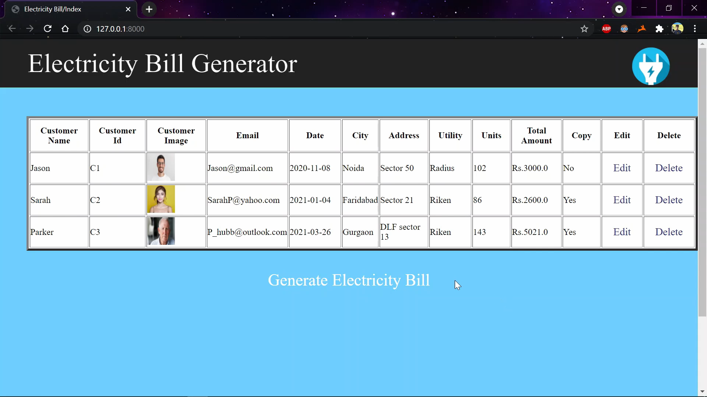
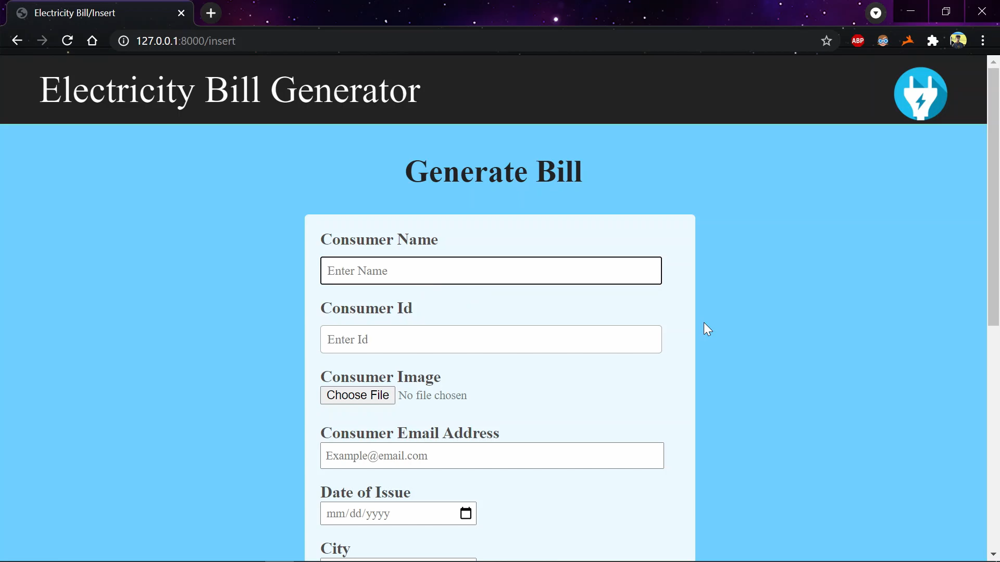
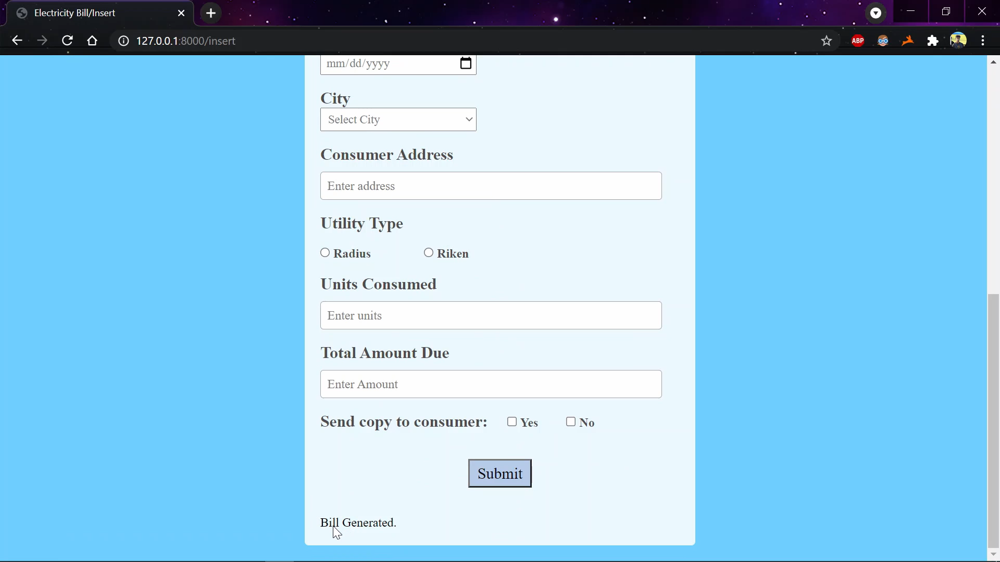
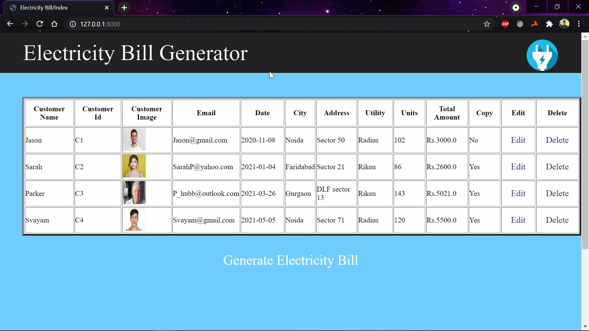
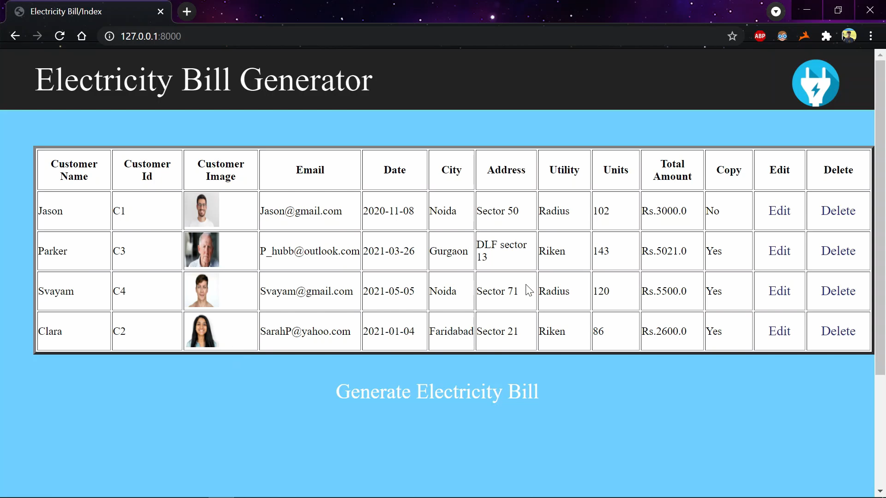
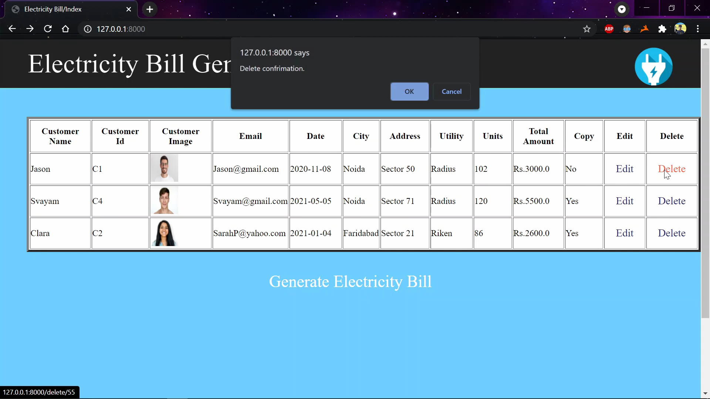
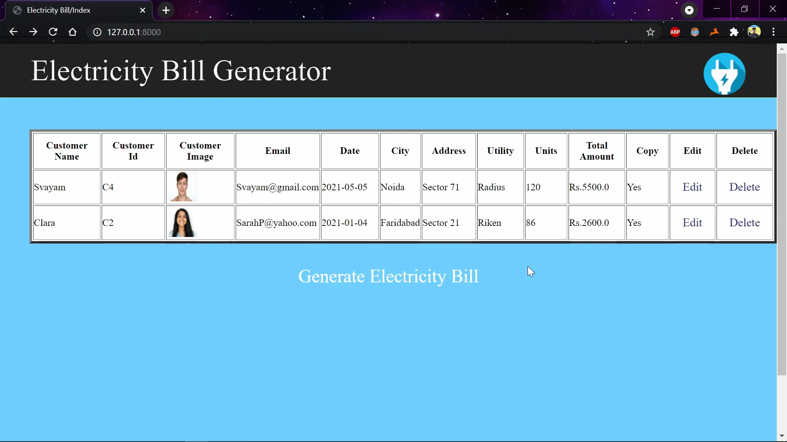

# Capstone_ElectricityBill
An Electricity-Bill generator where we can perform CRUD operation ie. add, delete, update and read consumer details. 
Using <b>Django</b> and <b>PostgreSQL</b>

<h2>Home Page</h2>

<h2>CRUD Functionality - Create</h2>

<h2>Bill Generated</h2>

<h2>CRUD Functionality - Update</h2>

<h2>CRUD Functionality - Delete</h2>

